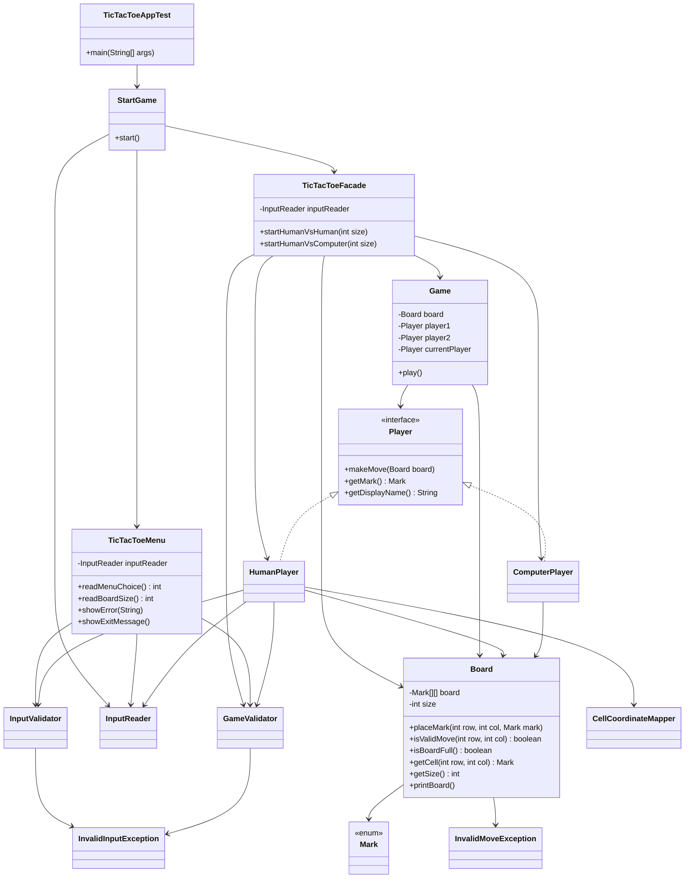

# TicTacToe Facade

Console Tic-Tac-Toe application implemented with the GoF Facade pattern.

## Overview

- `StartGame` is the entry orchestration class.
- `TicTacToeMenu` handles menu and board-size input.
- `TicTacToeFacade` exposes simple APIs for game modes:
  - `startHumanVsHuman(int size)`
  - `startHumanVsComputer(int size)`
- `Game`, `Board`, and `Player` implementations contain core gameplay logic.
- Input and validation are separated into `io` and `validation` packages.

## Package Structure

- `model/` - game domain (`StartGame`, `Game`, `Board`, `Mark`)
- `model/facade/` - facade layer (`TicTacToeFacade`, `TicTacToeMenu`)
- `model/player/` - player abstraction and concrete players
- `model/io/` - input reader abstraction
- `model/validation/` - validation and coordinate mapping
- `model/exception/` - custom runtime exceptions
- `test/` - app launcher (`TicTacToeAppTest`)

## Package Breakdown

| Package | Classes | Role |
| --- | --- | --- |
| `model` | `StartGame`, `Game`, `Board`, `Mark` | Core game flow, board state, and mark type |
| `model.facade` | `TicTacToeFacade`, `TicTacToeMenu` | Facade API and menu/presentation input flow |
| `model.player` | `Player`, `HumanPlayer`, `ComputerPlayer` | Player abstraction and move behaviors |
| `model.io` | `InputReader` | Console input wrapper |
| `model.validation` | `InputValidator`, `GameValidator`, `CellCoordinateMapper` | Input parsing, rule validation, and cell-to-coordinate mapping |
| `model.exception` | `InvalidInputException`, `InvalidMoveException` | Domain-specific runtime exceptions |
| `model.images` | `Tic Tac Toe Game-Class Diagram.png` | Class diagram asset used in README |
| `test` | `TicTacToeAppTest` | Application launcher (`main`) |

## Design Patterns Used

| Pattern | Where | Description |
| --- | --- | --- |
| Facade | `TicTacToeFacade` | Exposes high-level game-start APIs and hides object wiring (`Board`, `Game`, players) |
| Strategy (behavior by interface) | `Player` <- `HumanPlayer`, `ComputerPlayer` | `Game` works with `Player` abstraction while move behavior varies by concrete player |
| Polymorphism | `Game` + `Player` hierarchy | Turn handling and winner flow rely on common player contract instead of concrete checks |
| Layered Validation Utility | `InputValidator`, `GameValidator`, `CellCoordinateMapper` | Separates validation/mapping from gameplay and UI orchestration |

## Key Relationship Legend
| Arrow | Meaning |
|---|---|
| `──▶` solid line | **Association** — field reference |
| `──▷` solid with triangle | **Inheritance** (`extends`) |
| `╌╌▷` dashed with triangle | **Implementation** (`implements`) |
| `╌╌▶` dashed line | **Dependency** — creates or uses transiently |
| `◇──` diamond | **Aggregation** — "has many" collection |

## Class Diagram




## Run

From workspace root `swabhav_training`:

```bash
javac -d out $(find src -name "*.java")
java -cp out tictactoe.tictactoe_facade.test.TicTacToeAppTest
```
