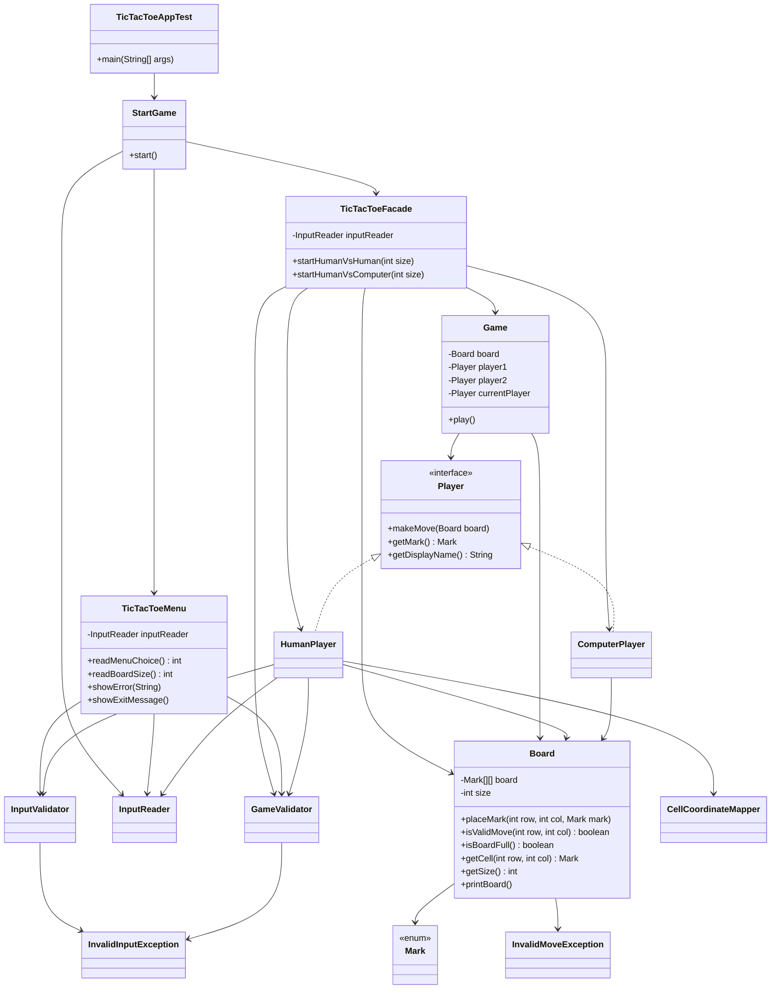

# TicTacToe Facade

Console Tic-Tac-Toe application implemented with the GoF Facade pattern.

## Overview

- `StartGame` is the entry orchestration class.
- `TicTacToeMenu` handles menu and board-size input.
- `TicTacToeFacade` exposes simple APIs for game modes:
  - `startHumanVsHuman(int size)`
  - `startHumanVsComputer(int size)`
- `Game`, `Board`, and `Player` implementations contain core gameplay logic.
- Input and validation are separated into `io` and `validation` packages.

## Package Structure

- `model/` - game domain (`StartGame`, `Game`, `Board`, `Mark`)
- `model/facade/` - facade layer (`TicTacToeFacade`, `TicTacToeMenu`)
- `model/player/` - player abstraction and concrete players
- `model/io/` - input reader abstraction
- `model/validation/` - validation and coordinate mapping
- `model/exception/` - custom runtime exceptions
- `test/` - app launcher (`TicTacToeAppTest`)

## Package Breakdown

| Package | Classes | Role |
| --- | --- | --- |
| `model.user` | `User`, `BaseUser`, `Admin`, `Customer`, `DeliveryAgent`, `UserFactory`, `TriFunction` | User domain models, inheritance hierarchy, and factory |
| `model.order` | `MenuComponent`, `MenuItem`, `MenuCategory`, `Cart`, `Order` | Menu composite pattern, shopping cart, and orders |
| `model.payment` | `PaymentStrategy`, `CashPayment`, `UpiPayment`, `Payment`, `PaymentFactory`, `Discount` | Strategy pattern for payments and factory |
| `model.enums` | `DeliveryAgentStatus`, `OrderStatus`, `PaymentMode` | Status and type enumerations |
| `exception` | `EmptyCartException`, `RestaurantClosedException`, `UserNotFoundException` | Custom checked exceptions |
| `observer` | `Observer`, `AdminObserver`, `CustomerObserver`, `DeliveryAgentObserver`, `EventManager` | Observer pattern for event notifications |
| `service` | `BaseService`, `AdminService`, `CustomerService`, `DeliveryAgentService`, `CartService`, `OrderService`, `DiscountService`, `InvoiceService` | Business logic layer |
| `panel` | `AdminPanel`, `CustomerPanel`, `DeliveryAgentPanel` | Console UI and presentation layer |
| `facade` | `FoodOrderingFacade` | Facade pattern and single entry point |
| `util` | `IdGenerator` | Auto-incrementing ID utility |

## Design Patterns Used

| Pattern | Where | Description |
| --- | --- | --- |
| Singleton | `Admin` | Double-checked locking ensures one admin instance |
| Factory | `UserFactory`, `PaymentFactory` | Creates `User` / `PaymentStrategy` from type string |
| Strategy | `PaymentStrategy` <- `CashPayment`, `UpiPayment` | Swappable payment algorithms |
| Composite | `MenuComponent` <- `MenuItem`, `MenuCategory` | Tree structure for nested menu categories |
| Observer | `Observer` <- `AdminObserver`, `CustomerObserver`, `DeliveryAgentObserver` + `EventManager` | Event-driven order status notifications |
| Facade | `FoodOrderingFacade` | Simplifies system startup and panel routing |

## Key Relationship Legend

| Arrow | Meaning |
| --- | --- |
| `--->` solid line | Association - field reference |
| `---|>` solid with triangle | Inheritance (`extends`) |
| `- -|>` dashed with triangle | Implementation (`implements`) |
| `- -->` dashed line | Dependency - creates or uses transiently |
| `<>---` diamond | Aggregation - has many collection |

## Class Diagram




## Run

From workspace root `swabhav_training`:

```bash
javac -d out $(find src -name "*.java")
java -cp out tictactoe.tictactoe_facade.test.TicTacToeAppTest
```
